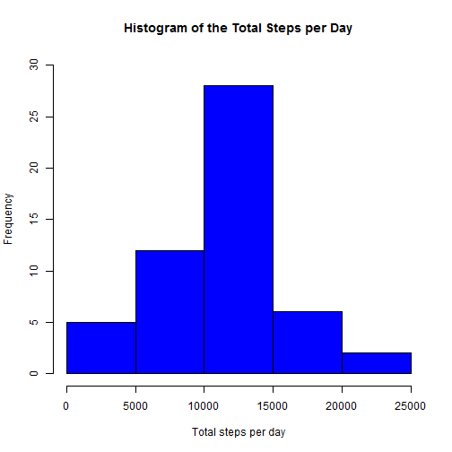
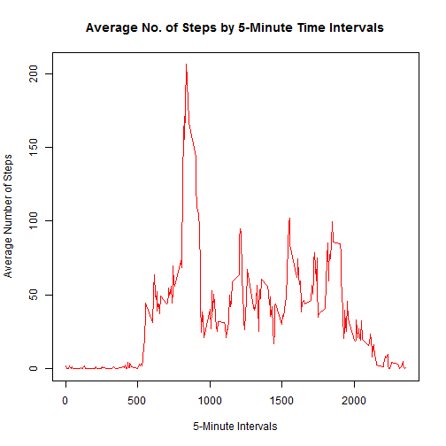
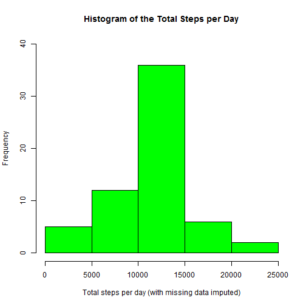
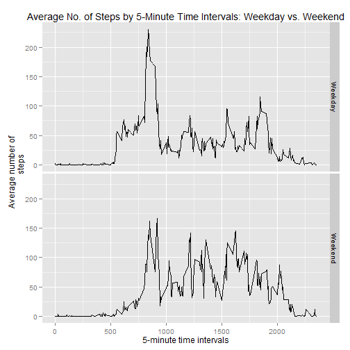

-------------------------------------------------
title: "Reproducible Research: Peer Assessment 1"
output: 
  html_document:
    keep_md: true
-------------------------------------------------

# Reproducible Research: Peer Assessment 1

The following document contains the text, code and output that is used to address the questions
for Peer Assessment 1

## Loading and preprocessing the data

The first step is to download the ZIP file that contains the assignment data.  The following code
downloads the file to an assigned location and then unzips the file to another location.


```r
fileUrl<-"https://d396qusza40orc.cloudfront.net/repdata%2Fdata%2Factivity.zip"
download.file(fileUrl,destfile="./PA1.zip")
unzip("./PA1.zip",exdir="./Data")
```

The next line of code reads the data into R.


```r
dat<-read.csv("./Data/activity.csv")
```

At this point, no other preprocessing of the data is required to address the first few questions.


## What is the mean total number of steps taken per day?

The 'dplyr' packaged is called and the data is converted into a table for the analysis.


```r
library(dplyr)
df<-tbl_df(dat)
```

The data is grouped by the 'date' field and the total steps are calculated for each date.


```r
dat.sum<-df%>%
  group_by(date)%>%
  summarise(sum(steps))
```

Additional code is used to clean up the column names and convert the table back into a data frame.


```r
colnames(dat.sum)<-c("date","steps")
dat.sum<-data.frame(dat.sum)
```

Now the data is ready to plot.  A histogram is called on the total number of steps per day.


```r
hist(dat.sum$steps,ylim=c(0,30),col="blue",main="Histogram of the Total Steps per Day",
     xlab="Total steps per day")
```

 

In addition, both the mean and median for the total number of steps per day is calculated.


```r
mean.steps<-mean(dat.sum$steps,na.rm=TRUE)
med.steps<-median(dat.sum$steps,na.rm=TRUE)
```

### ANSWER:

Mean & Median - Total Number of Steps per Day:
The mean and median are both around 10,766 steps per day.

```r
mean.steps
```

```
## [1] 10766.19
```

```r
med.steps
```

```
## [1] 10765
```


## What is the average daily activity pattern?

A second table is created for the next question.


```r
df2<-tbl_df(dat)
```

The data is now grouped by interval and the average number of steps for each interval
is calculated.


```r
dat.sum2<-df2%>%
  group_by(interval)%>%
  summarise(mean(steps,na.rm=TRUE))
```

Once again, the column names are cleaned up and the data is converted back into a data frame.


```r
colnames(dat.sum2)<-c("interval","avg.steps")
dat.sum2<-data.frame(dat.sum2)
```

Now a times series plot is created with the new data showing the average number of steps for each time interval.


```r
plot(dat.sum2$interval,dat.sum2$avg.steps,type="l",lwd=1.5,col="red",
     main="Average No. of Steps by 5-Minute Time Intervals",
     ylab="Average Number of Steps",xlab="5-Minute Intervals")
```

 

The interval with the largest number of average steps is calculated.


```r
max.steps<-max(dat.sum2$avg.steps)
max.interval<-dat.sum2$interval[dat.sum2$avg.steps==max.steps]
```

### ANSWER:

Max Interval - The largest number of steps are taken in the morning, around 8:35 AM.

```r
max.interval
```

```
## [1] 835
```


## Imputing missing values

The following code explores the nature of missing values in the data set.  A logical vector is
created to record where the missing values are located.  Then the date field is subsetted with this
logical vector to find the missing dates.  When the summary for 'missing.dates' is printed, we
notice that there are only 8 days with missing values, but all of these days are missing every
measurement (288) for that day. (288 measurement * 8 days = 2,304 missing values)


```r
sum(is.na(dat))
```

```
## [1] 2304
```

```r
missing.log<-is.na(dat$steps)
missing.dates<-dat$date[missing.log]
summary(missing.dates)
```

```
## 2012-10-01 2012-10-02 2012-10-03 2012-10-04 2012-10-05 2012-10-06 
##        288          0          0          0          0          0 
## 2012-10-07 2012-10-08 2012-10-09 2012-10-10 2012-10-11 2012-10-12 
##          0        288          0          0          0          0 
## 2012-10-13 2012-10-14 2012-10-15 2012-10-16 2012-10-17 2012-10-18 
##          0          0          0          0          0          0 
## 2012-10-19 2012-10-20 2012-10-21 2012-10-22 2012-10-23 2012-10-24 
##          0          0          0          0          0          0 
## 2012-10-25 2012-10-26 2012-10-27 2012-10-28 2012-10-29 2012-10-30 
##          0          0          0          0          0          0 
## 2012-10-31 2012-11-01 2012-11-02 2012-11-03 2012-11-04 2012-11-05 
##          0        288          0          0        288          0 
## 2012-11-06 2012-11-07 2012-11-08 2012-11-09 2012-11-10 2012-11-11 
##          0          0          0        288        288          0 
## 2012-11-12 2012-11-13 2012-11-14 2012-11-15 2012-11-16 2012-11-17 
##          0          0        288          0          0          0 
## 2012-11-18 2012-11-19 2012-11-20 2012-11-21 2012-11-22 2012-11-23 
##          0          0          0          0          0          0 
## 2012-11-24 2012-11-25 2012-11-26 2012-11-27 2012-11-28 2012-11-29 
##          0          0          0          0          0          0 
## 2012-11-30 
##        288
```

Now that we know which days have missing values, we can do some recoding to replace the missing 
values. The following code replaces each of the NA's with the average steps for each interval,
which was already calculated above for the second question.


```r
dat2<-dat
dat2$steps.i<-dat2$steps
dat2$steps.i[dat2$date=="2012-10-01"]<-dat.sum2$avg.steps
dat2$steps.i[dat2$date=="2012-10-08"]<-dat.sum2$avg.steps
dat2$steps.i[dat2$date=="2012-11-01"]<-dat.sum2$avg.steps
dat2$steps.i[dat2$date=="2012-11-04"]<-dat.sum2$avg.steps
dat2$steps.i[dat2$date=="2012-11-09"]<-dat.sum2$avg.steps
dat2$steps.i[dat2$date=="2012-11-10"]<-dat.sum2$avg.steps
dat2$steps.i[dat2$date=="2012-11-14"]<-dat.sum2$avg.steps
dat2$steps.i[dat2$date=="2012-11-30"]<-dat.sum2$avg.steps
```

Now that a second data frame has been created, with the missing values replaced, another table is
created for the next stage of analysis.


```r
df3<-tbl_df(dat2)
```

The data is once again grouped by date and the total number of steps per day (with the missing
values replaced) is calculated.


```r
dat.sum3<-df3%>%
  group_by(date)%>%
  summarise(sum(steps.i))
```

The column names are cleaned up and the data is converted back into a data frame.


```r
colnames(dat.sum3)<-c("date","steps.i")
dat.sum3<-data.frame(dat.sum3)
```

Another histogram is created with the adjusted data.


```r
hist(dat.sum3$steps.i,ylim=c(0,40),col="green",
     main="Histogram of the Total Steps per Day",
     xlab="Total steps per day (with missing data imputed)")
```

 

The mean and the median for the total number of steps per day is calculated again with the new data.


```r
mean.steps.i<-mean(dat.sum3$steps.i)
med.steps.i<-median(dat.sum3$steps.i)
```

### ANSWER:

Mean & Median - Total Number of Steps per Day (Adjusted Data): 
The mean and median are now exactly the same (10,766.19). The process of replacing the missing data with the average number of steps for each interval has drawn the entire sample closer to the overall mean for total number of steps per day. Not only does the histogram peak higher in the middle (with an increase from 28 to 36) but now the median moves toward the mean as the slight positive skew in the data disappears with the presence of the new numbers that give more power to the overall mean.


```r
mean.steps.i
```

```
## [1] 10766.19
```

```r
med.steps.i
```

```
## [1] 10766.19
```


## Are there differences in activity patterns between weekdays and weekends?

The 'date' field for the new dataset has to be reset to the Date class.


```r
dat2$date<-as.Date(dat2$date)
```

The weekdays function pulls out the actual weekday names from the date field.


```r
dat2$weekdays<-weekdays(dat2$date)
```

A simple recode is used to replace the weekday names with a bivariate (Weekday or Weekend) variable.


```r
dat2$weekdays[dat2$weekdays=="Monday"]<-"Weekday"
dat2$weekdays[dat2$weekdays=="Tuesday"]<-"Weekday"
dat2$weekdays[dat2$weekdays=="Wednesday"]<-"Weekday"
dat2$weekdays[dat2$weekdays=="Thursday"]<-"Weekday"
dat2$weekdays[dat2$weekdays=="Friday"]<-"Weekday"
dat2$weekdays[dat2$weekdays=="Saturday"]<-"Weekend"
dat2$weekdays[dat2$weekdays=="Sunday"]<-"Weekend"
```

The resulting weekdays variable is then converted into a factor variable.


```r
dat2$weekdays.f<-factor(dat2$weekdays, levels=c("Weekday","Weekend"))
```

The new data is converted into a table.


```r
df4<-tbl_df(dat2)
```

The data is grouped by two variables this time.  First, by the 'Weekday/Weekend' factor variable,
then by the interval.  The average number of steps by interval for Weekdays and the average number
of steps by interval for Weekends is calculated.


```r
dat.sum4<-df4%>%
        group_by(weekdays.f,interval)%>%
        summarise(mean(steps.i))
```

The column names are cleaned up and the data is converted back into a data frame.


```r
colnames(dat.sum4)<-c("weekday","interval","avg.steps.i")
dat.sum4<-data.frame(dat.sum4)
```

Now that the data has been altered, a panel plot with time series data is created, which splits out
the data by Weekday vs. Weekend.


```r
library(ggplot2)
time.plot <- ggplot(dat.sum4, aes(x=interval, y=avg.steps.i)) + geom_line(shape=1)
time.plot + facet_grid(weekday ~ .) + xlab("5-minute time intervals") + ylab("Average number of
        steps") + ggtitle("Average No. of Steps by 5-Minute Time Intervals: Weekday vs. Weekend")
```

 

### ANSWER:

The panel plot does not show a drastic difference between Weekday and Weekend activity, however, it
is clear that the peak of activity during the Weekdays is early in the day.  Whereas, on the
weekend, the activity begins a little later in the day and the morning does not peak the same way
it does during the weekdays.  Also, during the weekends, throughout the rest of the day the total activity appears to be higher than it is for the weekdays.
